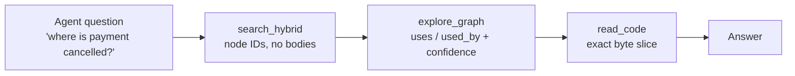
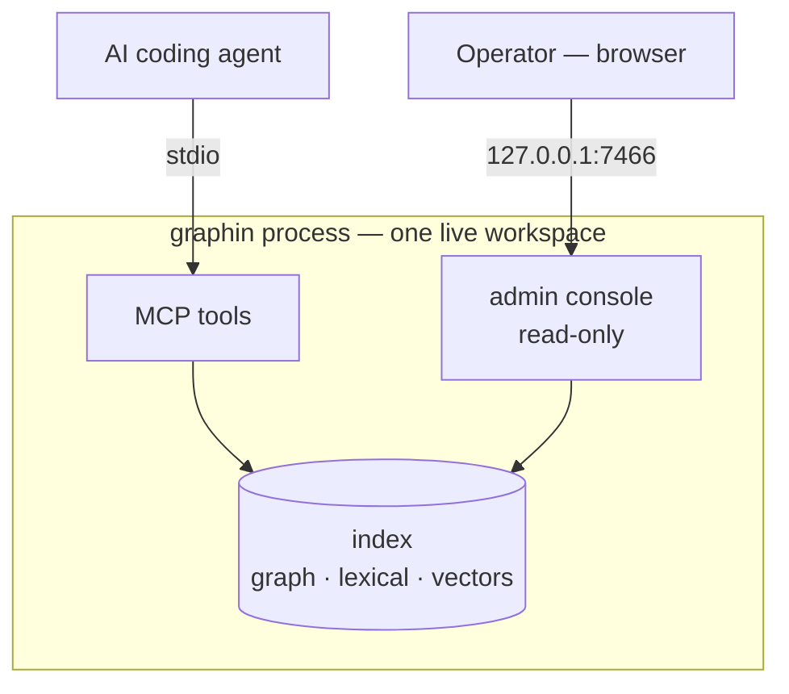
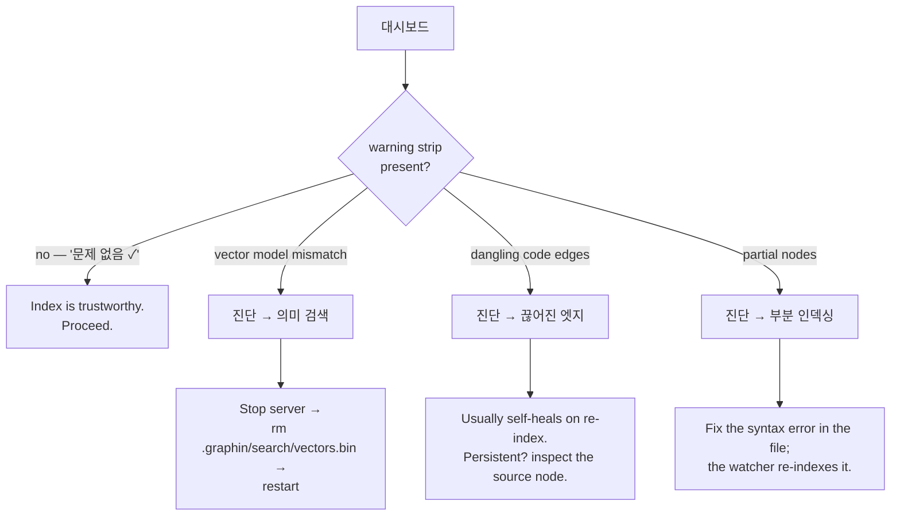
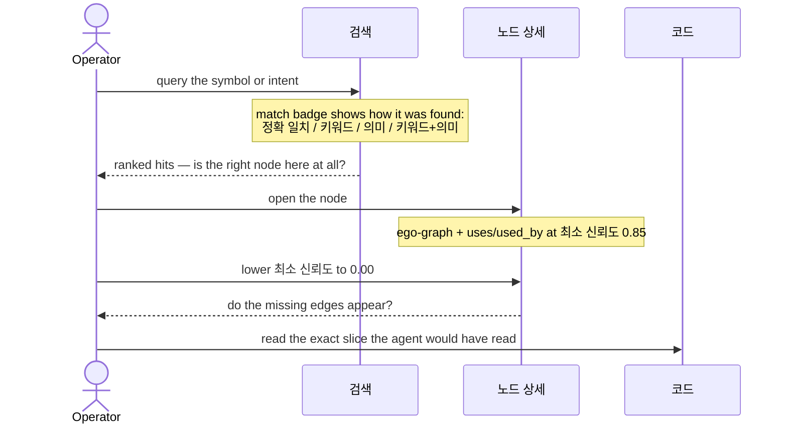
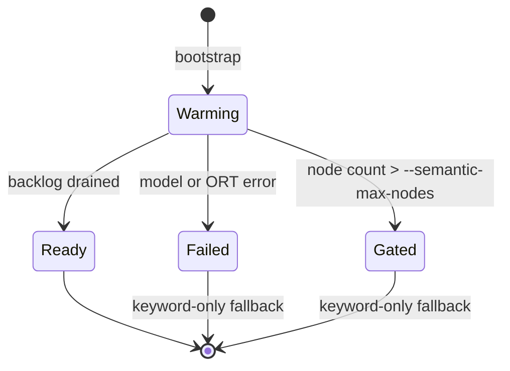

# graphin Admin — Use Cases

What the admin console is for, what an operator checks on it, how they drive it,
and what a healthy reading looks like.

Companion docs: [DESIGN.md](DESIGN.md) (UI spec) · [DECISIONS.md](DECISIONS.md)
(graphin-specific design judgments).

---

## 1. Context — what graphin does

graphin is a **local code-graph MCP server for AI coding agents**. Instead of
letting an agent burn tokens on linear `grep` sweeps, it exposes the codebase
through three progressively narrowing steps.

The index behind those tools is built from tree-sitter parses of Java, Kotlin,
Python, JavaScript and TypeScript, plus optional RDB schema snapshots
(`*.graphindb.json`) that add table/view/function nodes and code→table edges.

**The agent never reports on the index's health.** It just answers, well or
badly, and a stale or partial index degrades answers silently. That is the gap
the admin console fills.

---

## 2. Why the console exists

It is a **read-only window onto the same live workspace the agent is querying**,
mounted in the same process via `--admin-addr`. Everything on it answers one of
three questions:

| # | Question | Screens |
|---|---|---|
| Q1 | **Is it up?** Can the agent get answers at all right now? | 대시보드, 로그 |
| Q2 | **Is it trustworthy?** Will those answers be complete and current? | 진단, 대시보드, 설정 |
| Q3 | **Is it earning its keep?** Does the agent actually use it, and where does it give up? | 계측, 검색, 구조, 노드 상세 |

Two properties follow from that framing, and both are deliberate:

- **The console never mutates anything.** Every route is `GET`. It is an
  instrument, not a control panel — see §6.
- **It is bound to loopback only** and validates the `Host` header, so it is a
  local developer tool, not a served dashboard.

---

## 3. Screen map

| Screen | Answers | Key signals |
|---|---|---|
| 대시보드 | Q1, Q2 | state badge, indexing progress, node/edge/shard counts, health summary, warning strip |
| 구조 | Q3 | package → file → node tree; what the agent can actually see |
| 검색 | Q3 | same ranking path as `search_hybrid`; match badges |
| 노드 상세 | Q2, Q3 | ego-graph, uses/used_by with confidence, exact source slice |
| 진단 | Q2 | dangling edges, partial nodes, semantic status, reverse-index stats |
| 로그 | Q1, Q2 | `agent-nav.log` tail — watcher batches, re-index, embedding events |
| 계측 | Q3 | adoption / fallback metrics from the `graphin-usage` plugin |
| 설정 | Q2 | effective startup flags vs defaults, model spec, gate, disk footprint |

---

## 4. Use cases

Each case states the trigger, the operator's path, the healthy reading, and —
because the console is read-only — the corrective action, which always happens
**outside** the page.

### UC-1 · Confirm the server is ready to serve an agent

**Trigger** First run after registering graphin, or after restarting the MCP
server.

**Path** 대시보드 → watch the 상태 card (polls every 2s, stops on its own once
nothing more will change).

**Expected**

| Stage | State badge | Reading |
|---|---|---|
| Before the agent calls `bootstrap_workspace` | `부트스트랩 전` (neutral) | Empty-state guidance. Normal — indexing is agent-triggered, not automatic. |
| Indexing | `인덱싱 중` (info) | Progress bar climbs; 키워드 검색 flips to 준비됨 first. |
| Ready | `준비됨` (ok) | Both 키워드 검색 and 의미 검색 read 준비됨; node/edge counts non-zero. |

Keyword search becomes usable well before embeddings finish — a workspace
showing `인덱싱 중` with 키워드 검색 준비됨 is already answering agent queries.

**Watch the 대시보드 card, not the sidebar badge.** The sidebar badge is rendered
at page load and does not poll, so it can read `인덱싱 중` on a page you have left
open after indexing finished. Only the 상태 card is live.

**If it never leaves 부트스트랩 전** the agent has not called
`bootstrap_workspace`. Ask it to, or check that the MCP registration points at
the right `--workspace`.

### UC-2 · Daily trust check before relying on agent answers

**Trigger** Start of a session; or an agent answer looked wrong and you want to
rule out the index.

**Path** 대시보드 → read the warning strip at the top.

The strip is the whole check. It appears only when something needs attention and
names each problem with a link straight to the relevant 진단 tab.

**Expected** `문제 없음 ✓`, and the sidebar 진단 item carries no count badge.

**Reading the three problems**

- **Vector model mismatch** — the stored `vectors.bin` was written by a
  different embedding model than the one now configured. Search quality degrades
  because the index is a mix of two vector spaces. This one is worth acting on
  immediately.
- **Dangling code edges** — an edge points at a node that is not in the index.
  Usually a deleted target or an unresolved reference. A small, stable count is
  normal in a large codebase.
- **Partial nodes** — files parsed with syntax errors. Edges inside the broken
  span may be missing, so exploration around those nodes is incomplete.

**On DB dangling edges specifically**: these are counted separately and are
*often intentional* — a reference to something outside the snapshot, such as
Supabase's `auth.users`. Do not treat the DB count as a defect without checking
what it points at.

### UC-3 · Debug "the agent gave a wrong or incomplete answer about X"

**Trigger** An agent missed a caller, or pointed at the wrong symbol.

**Path** This walks the same route the agent took, so you can see where it
diverged.

**Diagnosis by where it breaks**

| Observation | Meaning | Action |
|---|---|---|
| Node absent from 검색 entirely | Not indexed — excluded path, unsupported language, or indexing incomplete | Check 구조 for the file; check ignore rules |
| Node found, but the expected edge is missing at 0.85 and **appears at 0.00** | The edge exists but is a low-confidence inference | The agent's default `min_confidence` hid it — expected behaviour, not a bug |
| Edge missing even at 0.00 | The parser never resolved the reference | Likely dynamic dispatch or an unsupported construct |
| Edge present, target marked 대상 없음 | Dangling — target not in the index | See UC-2 |
| Code slice is wrong or shifted | Stale offsets | Check 로그 for the file's re-index event |

The 최소 신뢰도 selector is the single most useful control here. Confidence
tiers: `1.00` certain · `0.95` same package · `0.90` import-based · below that,
global-name guesses.

### UC-4 · Explore an unfamiliar codebase yourself

**Trigger** Onboarding, or sanity-checking what the agent can see.

**Path** 구조 → expand a package caret → file → node → click through to 노드 상세.

Expansion is lazy: children load on first click only, and the caret then just
folds.

**The 개수 column counts a different thing at each depth** — nodes contained, for
packages and files; outgoing references, for a node. Each cell names what it
counted on hover, since one header cannot label both. An unexpectedly tiny node
count on a package is itself a signal that something was excluded from indexing.

Package and file names are links to the flat table view, which is better for
scanning a whole package at once.

### UC-5 · Watch re-indexing keep up while you edit

**Trigger** You are editing and want to confirm the agent is seeing current code.

**Path** 로그 (tails `agent-nav.log`, refreshes every 3s) → filter by event name.

**Expected** After saving a file, a watcher batch event appears within seconds,
followed by re-index and — for changed symbols — embedding events. Error rows
are marked with a left bar and an 오류 tag.

**If nothing appears**, the watcher is not seeing your edits: check that the file
is under `--workspace` and not excluded (`node_modules/`, `dist/`, `.next/`,
`coverage/`, minified files and lockfiles are excluded by default).

### UC-6 · Determine whether semantic search is actually on

**Trigger** Natural-language queries return poor results.

**Path** 진단 → 의미 검색 tab.

| Status | Meaning | Action |
|---|---|---|
| 준비됨 | Vectors complete | None |
| 워밍업 중 | Still embedding — 임베딩 대기 counts down | Wait; keyword search works meanwhile |
| 비활성 (노드 수 게이트) | Repo exceeded the node ceiling, embedding never started | Raise `--semantic-max-nodes` and restart; the gate marker clears itself |
| 사용 불가 | Model or ONNX Runtime failed | Read the failure line; check `--offline` / `--model-dir` / `--ort-lib` in 설정 |

In the last three states graphin silently falls back to keyword-only search.
That is the fallback working as designed — but it explains why a natural-language
query underperforms.

### UC-7 · Measure adoption and mine failures to improve the index

**Trigger** Weekly review; or deciding whether graphin is worth keeping.

**Requires** the `graphin-usage` Claude Code plugin installed — otherwise 계측
shows an empty state. It is observation-only by design; it never intervenes in
agent behaviour, because intervening would corrupt the very signal it measures.

**Path** 계측 → read the headline table, then the 폴백 페어 table.

| Metric | Reads as |
|---|---|
| 채택률 | graphin call led straight to `Read`/`Edit` — the agent found what it wanted |
| 폴백 | graphin call followed by `Grep` — the agent gave up on the result |
| 동일 의도 | Fallback whose grep pattern shares tokens with the graphin query |
| 늦은 전환 | Agent reached for graphin only after grepping first |
| 탐색 실패 | Windows with a search but no graphin use at all |

**The 폴백 페어 table is the actionable output.** Each same-intent row is a
reproducible case where `search_hybrid` missed something the agent then found by
literal grep — a concrete test case for ranking or indexing work. Rising
adoption over the 일별 추이 chart is the confirmation that a fix landed.

A high 늦은 전환 or 탐색 실패 rate is not an index problem — it means the agent
is not being steered to graphin first, which is a prompt/skill issue.

### UC-8 · Trace which code touches a database table

**Trigger** Planning a schema change; assessing blast radius.

**Requires** a committed `*.graphindb.json` snapshot. Without one there are no
table nodes.

**Path** 검색 for the table name → open the table node → read **참조됨 (used_by)**.

**Expected** One hop lists the code nodes that reference the table. Confidence
encodes how the link was established: `1.00` explicit physical name (JPA
`@Table`, `__tablename__`, TypeORM `@Entity("x")`) · `0.90` ORM client access or
SQL string literal · `0.80` class-name convention.

At `0.80` treat hits as candidates, not facts — that tier is a naming-convention
guess.

### UC-9 · Review effective configuration and disk footprint

**Trigger** Before changing startup flags; or `.graphin/` is larger than expected.

**Path** 설정.

The 유효 설정 table shows every startup flag with its live value and how it
compares to the built-in default. A changed row promotes its label and shows the
default struck through.

**One caveat, stated on the page**: the 기본값 대비 column is a *value
comparison*, not a record of what you typed. Passing a flag explicitly with its
default value still reads as 기본값. The 워크스페이스 경로 row has no meaningful
default and reads 기동 지정.

Storage is broken out by subdirectory — `search/` (vectors + BM25), `graph/`
(shards + reverse index), `runtime/` (model + ONNX Runtime), `usage/` (telemetry).
`runtime/` dominating is normal; `search/` growing without bound suggests
re-embedding churn worth correlating with 로그.

---

## 5. Interaction reference

Everything the console responds to. There is nothing else to learn.

| Control | Where | Effect |
|---|---|---|
| Sidebar nav | all | Navigate. Counts and warning badges sit on the right of each item |
| 전역 검색 | sidebar | Symbol search from any screen |
| ⓘ button | next to domain terms | Loads an explanation popover. Click-only; click outside or press `Esc` to close |
| Caret `▸` | 구조 tree | First click loads children, later clicks fold |
| 최소 신뢰도 | 노드 상세 | Re-filters ego-graph and both edge lists live |
| 더 보기 | edge lists | Next 20 edges (cursor pagination) |
| 이벤트 filter | 로그 | Narrows the tail to one event name |
| Tabs | 진단 | Switch diagnostic view |
| 복사 | code viewer | Copies the source slice without line numbers |
| ☾ / ☀ | sidebar footer | Light/dark theme; persists locally |

---

## 6. Boundaries

**The console diagnoses; the terminal fixes.** Every corrective action in §4
happens outside the page — restarting with different flags, deleting
`vectors.bin`, committing a schema snapshot, fixing a syntax error. This is a
deliberate constraint, not a missing feature: graphin is an observation surface
for agent behaviour, and an admin page that mutated indexing state would
contaminate the adoption metrics it reports.

It also does not:

- **Trigger indexing.** `bootstrap_workspace` is the agent's call to make.
- **Edit configuration.** graphin has no config file; startup flags come from
  the MCP registration and require a restart.
- **Reach a live database.** DB nodes come only from committed snapshots.
- **Serve remotely.** Loopback bind plus `Host` validation; static assets are
  embedded so it works fully offline.

If the admin address fails to bind, graphin logs a warning and the MCP server
keeps running — the console is never on the critical path for the agent.
